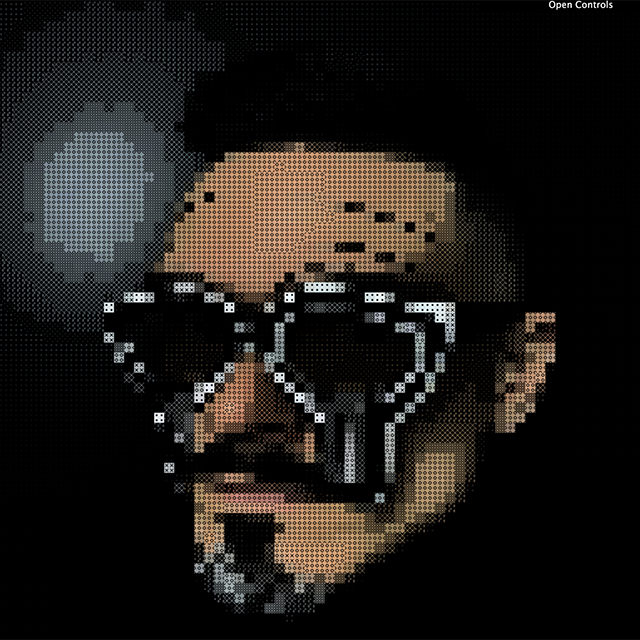

# Bitmask Dithering on Video or Webcam

## Set-up

If a webcam is present, if not a video is loaded and the shaders breakdown the image into quadrants and applies a bitmask to that area based on luminance.

## Shader Controls

- Color Mode (actual, hue palette)
- Hue Value 
- Saturattion
- Size
